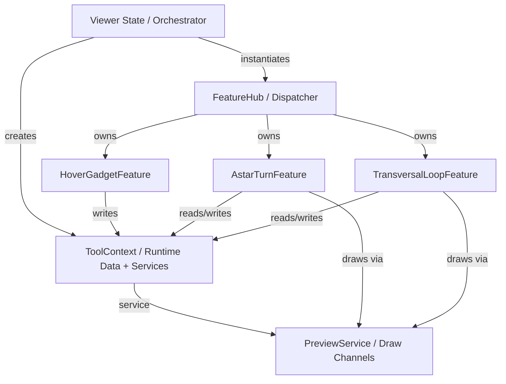
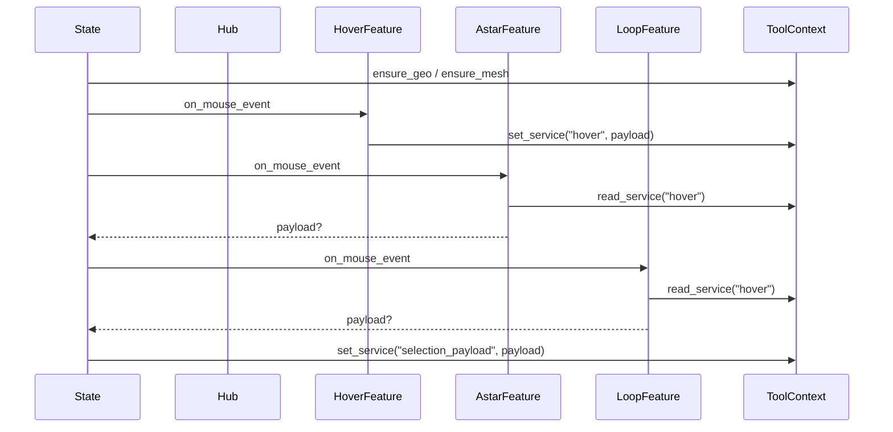
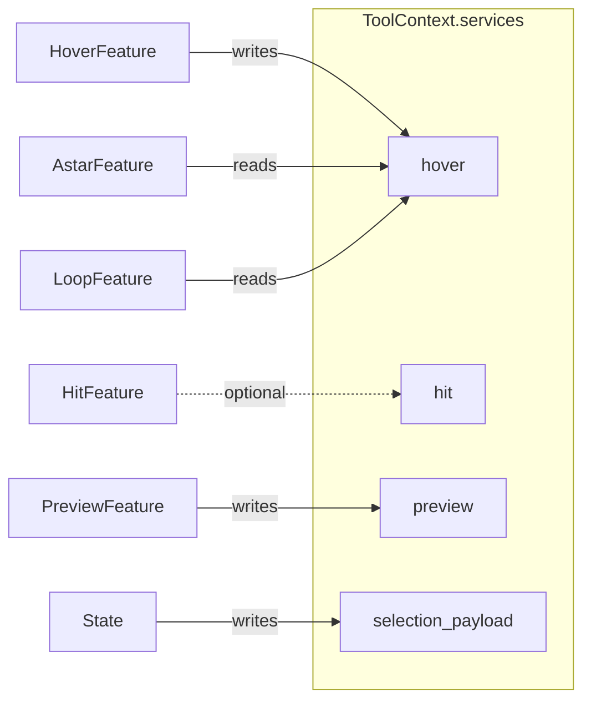
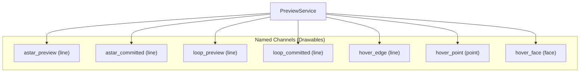
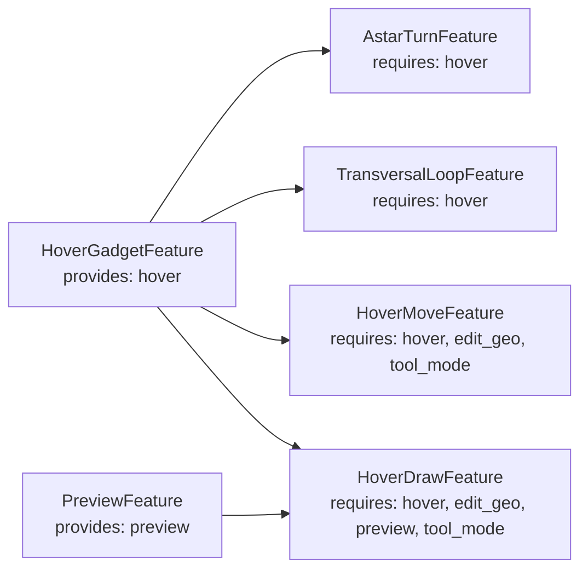

## Feature Pipeline Diagrams (2026-03-13)

### 1) High-Level Architecture (Hub-First Dispatch)

### 2) Event Flow (Mouse Event + Payload)

### 3) Services as "Boxes" (Context Services)

### 4) PreviewService Channels as "Lenses"

### 5) provides / requires Dependency Ordering

