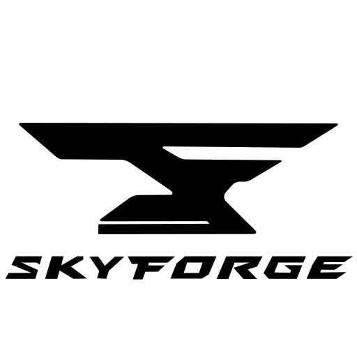

# 🌌 SkyForge 

**SkyForge** is a Python package for **SideFX Houdini** focused on building **interactive Scene Viewer tools** using Python Viewer States.

The main goal is to explore and develop **modeling and retopology workflows** that feel more **organic and gesture-driven**, directly in the viewport, while also providing a small **pipeline layer** (batch rendering, USD export, etc.).

> Project status: SkyForge is currently in a **foundation phase**.  
> The core architecture and modules are in place; modeling and retopo tools are built on top of this base.

---

## ✨ Goals

- Interactive modeling and **semi-assisted retopology** tools
- **Viewport-first** workflows (click / drag / snap / guides)
- Tools designed as **Python Viewer States**
- A **modular codebase** supporting:
  - modeling and retopo tools
  - batch rendering utilities
  - export workflows (USD, caches, etc.)

The project is intended as a **tool development R&D / portfolio project** around Houdini, focusing on viewport UX, tool architecture, and pipeline-oriented utilities.

---

## ✅ Current State

- `skyforge` Python package structure in place
- Modular organization (`core`, `mesh`, `motion`, `draw`, `store`, `tools`)
- Development helper for **hot-reloading** modules in Houdini

Core tools are built progressively on top of this foundation.
